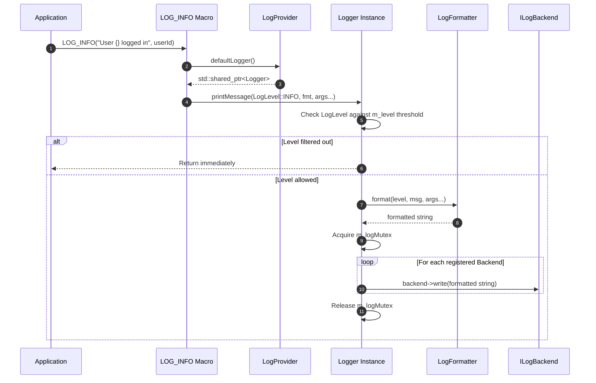

# Logger System Architecture – Technical Overview

This document provides an overview of the logging library's architectural components, data flows, and design principles.

---

## 1. System Layers & Components

The logger library is structured into clearly defined components:

```mermaid
flowchart TD
    App["Application Code"] -->|LOG_DEBUG / LOG_INFO / ...| Macros["Frontend Macros (Log.hpp)"]
    Macros -->|defaultLogger()| Provider["LogProvider (Service Locator)"]
    Provider --> LoggerInst["Logger Service Instance (Logger.hpp)"]
    
    subgraph Core ["Logger Engine"]
        LoggerInst -->|1. Filter by LogLevel| LevelCheck{"Level >= m_level?"}
        LevelCheck -->|No| Discard[Drop Message]
        LevelCheck -->|Yes| Formatter["LogFormatter (LogFormatter.hpp)"]
        Formatter -->|fmt::format + Config Fields| FormattedMsg[Formatted String]
    end
    
    subgraph Config ["Configuration Layer"]
        YamlFile["LogConfig.yaml"] --> ConfigParser["LogFormatterConfigParser"]
        ConfigParser -.->|Formatting Fields| Formatter
        ConfigParser -.->|Backend Settings| LoggerInst
    end
    
    subgraph Sinks ["Log Backends (ILogBackend)"]
        FormattedMsg --> MutexLock["Thread-Safe Dispatch (m_logMutex)"]
        MutexLock --> Console["ConsoleBackend (stdout)"]
        MutexLock --> File["FileBackend (filesystem)"]
        MutexLock --> Custom["Custom ILogBackend"]
    end
```

---

## 2. Component Responsibilities

### 2.1 Frontend & Service Locator (`Log.hpp` / `LogProvider.hpp`)
- **Macros (`LOG_DEBUG`, `LOG_INFO`, `LOG_WARNING`, `LOG_ERROR`)**: Provide a concise, printf-like / python-format interface for applications.
- **`LogProvider`**: Manages the lifecycle and global default instance of `Logger`. Allows lazy initialization via factories or direct dependency injection with `setDefaultLogger`.

### 2.2 Core Logger Engine (`Logger.hpp` / `Logger.cpp`)
- **Filtering**: Performs severity checking against the logger's global log level (`setCurrentLevel`) and per-backend log thresholds.
- **Concurrency**: Protects log output operations across backends using `std::mutex`.
- **Backend Management**: Holds registered output sinks (`BackendEntry`) with their respective minimum log level thresholds.

### 2.3 Formatter Layer (`LogFormatter.hpp` / `LogFormatterConfigParser.hpp`)
- **`LogFormatterConfigParser`**: Parses YAML configuration files to extract format specifications (fields: `timestamp`, `level`, `module`, `file`, `line`, `message`, and separators) as well as backend definitions.
- **`LogFormatter`**: Combines user message format strings with metadata using `{fmt}` and configured separators.

### 2.4 Output Backend Layer (`ILogBackend.hpp`)
- **`ILogBackend`**: Abstract interface defining the `write(const std::string&)` contract.
- **`ConsoleBackend`**: Emits logs to `std::cout`.
- **`FileBackend`**: Writes logs to a designated log file path with append mode.

---

## 3. Log Processing Lifecycle



---

## 4. Source Directory Structure

```
logger/
├── include/
│   ├── ILogBackend.hpp
│   ├── ConsoleBackend.hpp
│   ├── FileBackend.hpp
│   ├── LogLevel.hpp
│   ├── LogFormatterConfigParser.hpp
│   ├── LogFormatter.hpp
│   ├── Logger.hpp
│   ├── LogProvider.hpp
│   └── Log.hpp
├── src/
│   ├── ConsoleBackend.cpp
│   ├── FileBackend.cpp
│   ├── LogFormatterConfigParser.cpp
│   ├── LogFormatter.cpp
│   ├── Logger.cpp
│   └── LogProvider.cpp
├── example/
│   ├── config/LogConfig.yaml
│   └── main.cpp
├── test/
│   ├── ConsoleBackendTest.cpp
│   ├── FileBackendTest.cpp
│   ├── LogFormatterTest.cpp
│   ├── LoggerTest.cpp
│   └── mainTest.cpp
└── scripts/
    ├── build_native.sh
    ├── run_dev.sh
    └── docker/
```